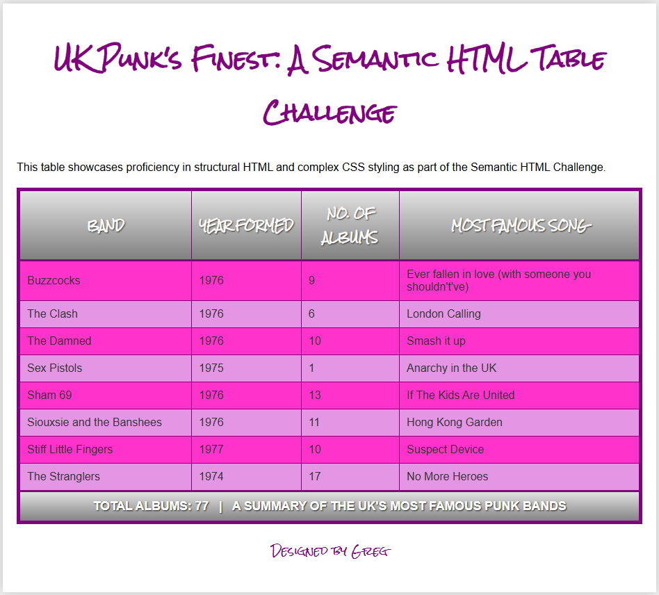
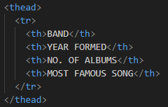
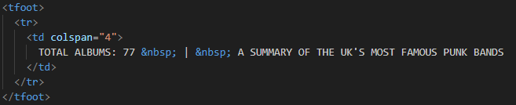
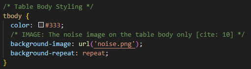

# Punk Rock Table Challenge: Completed Semantic HTML/CSS Table

This repository contains the completed solution for the **Semantic HTML/CSS Table Challenge**. The goal of this project was to leverage best practices in front-end development, focusing on clean semantic HTML and layered CSS to achieve a complex punk-inspired aesthetic.

---

# Project Overview

The core requirement was to construct a responsive data table and style it according to detailed design specifications, including:

* Unique background textures
* Custom fonts
* Complex colour palettes

---

# Key Features and Techniques Learnt

1. Semantic HTML Structure

Used `<thead>`, `<tbody>`, and `<tfoot>` to structure the table logically, improving accessibility and enabling targeted CSS.

2. Controlled Layout

Applied `table-layout: fixed` to create predictable column widths controlled via `<th>` elements.

3. Border Management

Used `border-collapse: collapse` to merge adjoining borders for a cleaner, single-line border appearance.

4. Layered CSS Styling

Gradient fill applied to header and footer (`<thead>` / `<tfoot>`)
Noise-textured background image applied to the table body (`<tbody>`)

5. Readability and Design

Implemented zebra striping with:

**Odd rows:** `#ff33cc` (Hot Pink)
**Even rows:** `#e495e4` (Light Pink/Mauve)

6. Responsiveness

Used percentage-based widths to ensure the table flexibly fills its container.

7. Typography

Included two fonts:

**Rock Salt**
**Helvetica Neue**

---

# Screenshots

Below are visual previews of the completed Semantic HTML/CSS Table.

### Screenshot 1 – Page Layout / Full Design

### Screenshot 2 – Header Gradient

### Screenshot 3 – Footer Gradient

### Screenshot 4 – Noise Texture Background

# Technology Used

Category | Tools

**Markup:** HTML5 (Semantic Elements)
**Styling:** CSS3 (Gradients, Background Images, Typography)

---

# Design Specifications Achieved

| Specification            | Details                                                 |
| ------------------------ | ------------------------------------------------------- |
| Full Container Width     | `<table>` fills 100% of container                       |
| Border Colour            | `#800080` (Purple) applied to `<table>`, `<th>`, `<td>` |
| Header/Footer Fill       | Gradient: `rgba(0,0,0,0.1)` → `rgba(0,0,0,0.5)`         |
| Body Background          | Noise texture applied to `<tbody>`                      |
| Zebra Stripe (Odd Rows)  | `#ff33cc`                                               |
| Zebra Stripe (Even Rows) | `#e495e4`                                               |
| Fonts                    | Rock Salt and Helvetica Neue                            |

---

# How to View the Project

1. Clone this repository: git clone https://github.com/Interlaken0/semantic-html-challenge/tree/master
2. Open `index.html` in your web browser.
